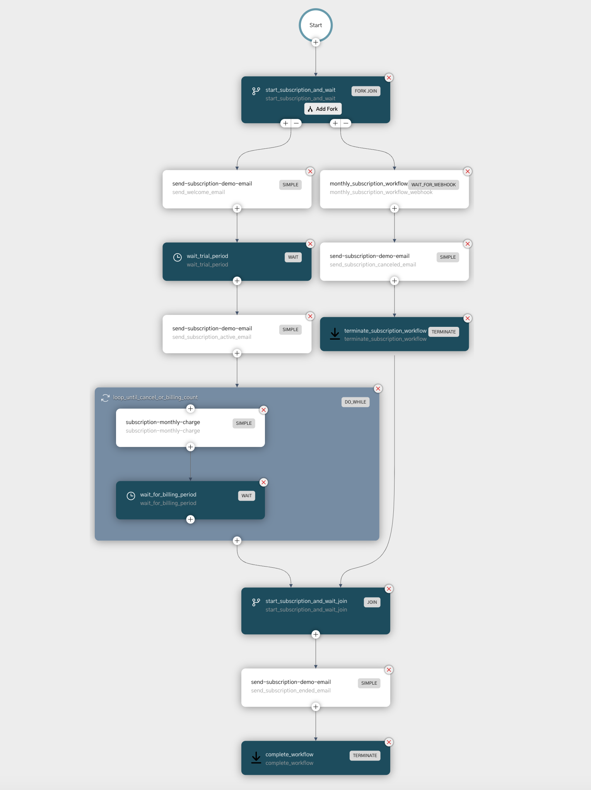

# Java Springboot Example for Managing Monthly Subscriptions using Netflix Conductor

Sample application demonstrating how to run a monthly subscription using Orkes Netflix Conductor - using Java and Spring Boot 2


## Running this Example

To run this example locally

1. Clone the project to your local
2. Update the application.properties with a `orkes.access.key` and `orkes.access.secret` that can connect to your conductor instance at `orkes.conductor.server.url`
   1. For connecting to playground - refer to this [article](https://orkes.io/content/how-to-videos/access-key-and-secret) to get a key and secret
   2. For connecting locally - follow the instructions [here (Install and Run Locally)](https://orkes.io/content/get-orkes-conductor)
3. From the root project folder, run `mvn spring-boot:run`


## Overview

This application has a controller - which is exposed in `SubcriptionApiController.java` and has two API methods

1. `/startSubscription` : When invoked, it will trigger a subscription workflow that handles the subscription workflow
2. `/cancelSubscription` : When invoked, it will call a webhook API into Conductor to signal that the subscription has ended

## Subscription Workflow

The business logic is as follows:

1. Trigger a subscription workflow - that includes a trial period
   1. Send a welcome email
   2. Wait for the trial period
2. Once trial period ends, it will start a billing process - that runs once every billing period
3. At the end of the number of billing periods, the workflow ends and notifies the user
4. At any point during the trial or billing user can cancel the subscription
5. User will be notified before trial starts, when billing starts and when subscription is completed or canceled

We can define this workflow visually as follows: 



Click [here](https://play.orkes.io/workflowDef/monthly_subscription_workflow_with_trial) to access this definition on Conductor playground

Here we are using two parallel forks where

1. In the first fork, we will handle the subscription flow
2. In the second fork, we will wait for a signal that the user is canceling

Either of the forks can complete and will end the workflow. To pass a signal we can use a webhook.

The webhook is configured to expect a header called `subscriptionflow` with value `subscription-flow-header-unique-value`

When this webhook is invoked, it will look for running workflows and match the parameter as defined in the 
`WAIT_FOR_WEBHOOK` task ([docs](https://orkes.io/content/reference-docs/system-tasks/wait-for-webhook))

Webhook invocation sample:

```shell

curl -H "Content-Type:application/json" -H "Accept:application/json" \
     -H 'subscriptionflow: subscription-flow-header-unique-value'    \
     -X POST 'https://play.orkes.io/webhook/ba70ba33-1a19-449e-98c2-d4581fcd9aad' \
     -d '{"event": {"userId" : "user-id-1"}}'

```

We can also invoke the same API from code - which is what we have done in `WorkflowService.java`

